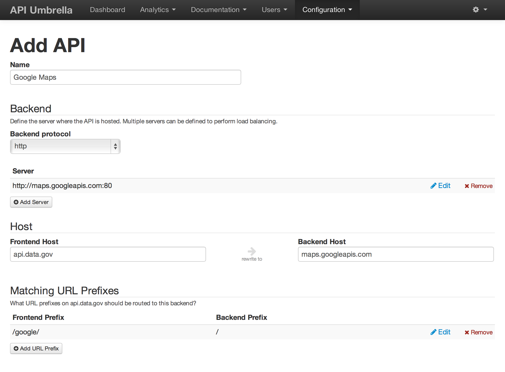
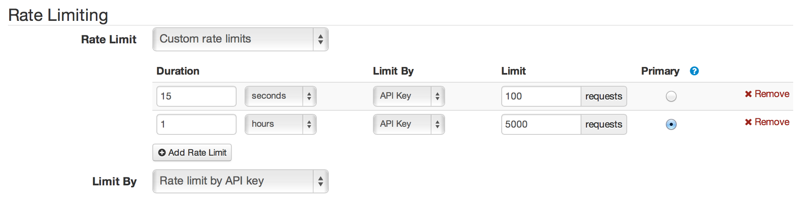
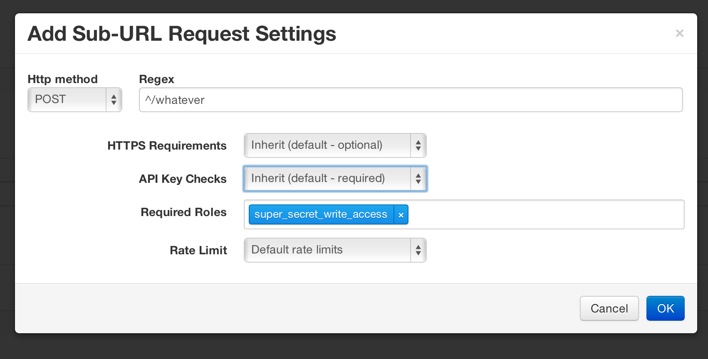
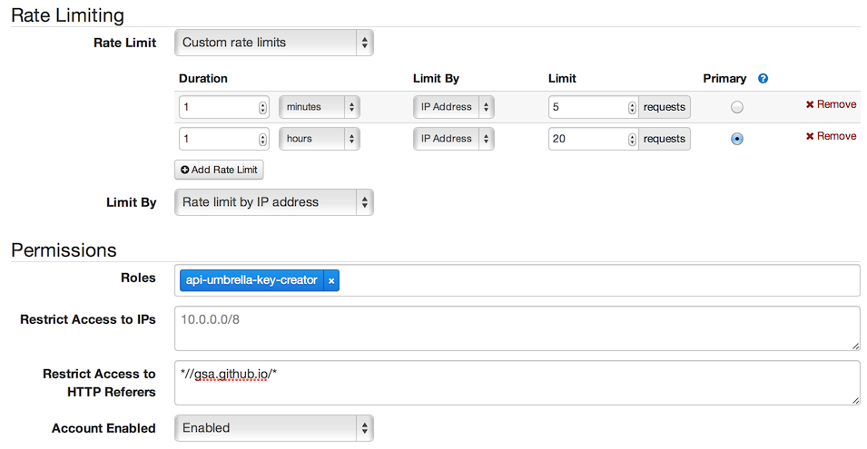
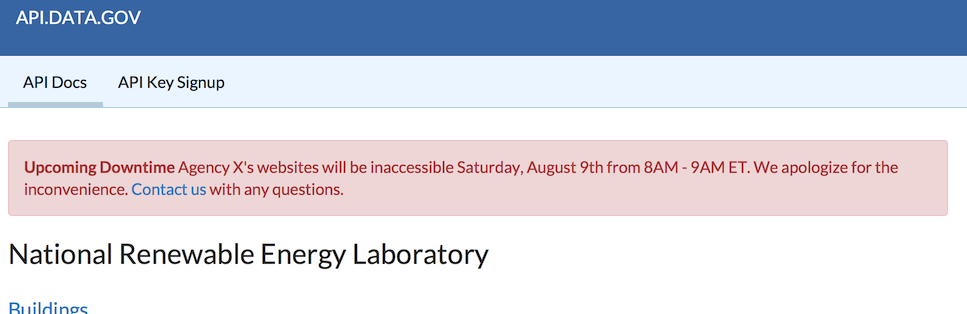

- [Configuring your first API backend](#configuring-your-first-api-backend)
- [Using your own domain name](#using-your-own-domain-name)
- [Securing your API backend](#securing-your-api-backend)
- [Managing admins](#managing-admins)
- [Filtering analytics data for just your APIs](#filtering-analytics-data-for-just-your-apis)
- [Caching API responses](#caching-api-responses)
- [Setting your API's default rate limits](#setting-your-apis-default-rate-limits)
- [Setting up per-user rate limits](#setting-up-per-user-rate-limits)
- [Client-side API key rate limits](#client-side-api-key-rate-limits)
- [Defining custom settings for specific URLs or specific types of requests](#defining-custom-settings-for-specific-urls-or-specific-types-of-requests)
- [Embedding the API key signup form on your own documentation site](#embedding-the-api-key-signup-form-on-your-own-documentation-site)
- [Linking to your own contact/support address](#linking-to-your-own-contactsupport-address)
- [API Key Creation API](#api-key-creation-api)
- [Admin APIs](#admin-apis)
- [How to post an alert box on api.data.gov and on the individual documentation pages to notify users of upcoming status changes.](#how-to-post-an-alert-box-on-apidatagov-and-on-the-individual-documentation-pages-to-notify-users-of-upcoming-status-changes)
- [API key stripping from analytics logs](#api-key-stripping-from-analytics-logs)
- [Using api.data.gov with Swagger / OpenAPI](#using-apidatagov-with-swagger--openapi)
- [Best practices when deprecating an API]()

## Configuring your first API backend

As a quick example, let's step through how you might setup http://api.data.gov/google/whatever to route to http://maps.googleapis.com/whatever as an API backend (but for your own case, you can imagine your agency's API taking the place of this Google example):

1. Login to the api.data.gov admin. (Don't have access? If your agency is interested in using api.data.gov, [contact us](https://api.data.gov/contact/#contact)).
2. In the top menu, navigate to the "Configuration" menu and pick "API Backends".
3. Click the "Add API Backend" button.
4. Here's how you would fill out the form to proxy http://api.data.gov/google/whatever to http://maps.googleapis.com/whatever as an example API backend:
  
    * *Note:* Be sure to add a server to the "Backend" section with the "Add Server" section, in addition to filling out the "Backend Host" field under the "Host" section. In most cases, these will be the same value, but they may differ depending on load balancing or virtual host configuration on your API backend.
5. Save your changes.
6. In order for your changes to go live, they must be published. In the top menu navigate to the "Configuration" menu and pick "Publish Changes". Review your changes here and then click the big "Publish" button.

## Using your own domain name

While we can quickly get you up and running on api.data.gov by using api.data.gov as your API's public endpoint, for production use, we recommend that agencies use their own domain name as their API's public endpoint. This makes your use of api.data.gov invisible, allows you to use api.data.gov without changing URLs for existing APIs, and ensures you're not locked into api.data.gov's service.

There are a few different ways to use your own domain name:

- **CNAME a subdomain (recommended):** If you can dedicate a subdomain to API requests, this is the most straightforward approach. As an example, you might setup `api.agency.gov`. This domain name would be CNAMEd to api.data.gov's servers. We would accept requests for that domain name, and then assuming they pass our validations (api key checks, rate limiting, etc), we would then pass the requests to your underlying API servers (which should be [secured](#securing-your-api-backend) to only accept connections from api.data.gov's servers).
  - CNAME settings: The CNAME you'll need to use won't actually be to api.data.gov directly. So please [contact us](https://api.data.gov/contact/) and we can quickly work with you to get a CNAME in place for your domain.
  - HTTPS: We will automatically handle SSL registration and renewal for your API subdomain after the CNAME is setup. No need to purchase or send us SSL certificates.
  - Non-API website content (for example, a home page, documentation, or a developer hub) can also be proxied to a separate destination (for example, GitHub Pages). See [hosting website content on your CNAMEd subdomain](#hosting-website-content-on-your-cnamed-subdomain) below.
- **Reverse proxying API requests on your end:** This approach is more complicated and is only recommended if your APIs are currently on a more general domain name (eg, `agency.gov/apis/*`) and you would like to use api.data.gov's services without changing your public URL endpoints. In this case, you would need to have the ability to reverse proxy certain URL paths on your agency server's end to our servers. As an example, if a user hit `agency.gov/apis/something` that would need to be reverse proxied to api.data.gov's servers. From there, we would perform our validations and assuming they pass, then send the request to your underlying API servers. This approach leads to an additional hop in network traffic (since it goes from your servers to our servers and then back to your servers), so it's not ideal (but in practice may be fine depending on where your servers are located and performance requirements).

### Setting up HTTPS on your own domain name

We can now automatically handle SSL certificate registration and renewal for custom domains CNAMEd to our service. There's no need to purchase or send us SSL certificates.

If you're an existing agency partner who has previously sent us custom SSL certificates, you may also switch to the new automatic SSL. In order to switch, the CNAME record you're using for your domain will simply need to be changed, so [contact us](https://api.data.gov/contact/) for further instructions.

If you're migrating an existing domain to use our automatic SSL, there's a couple of technical compatibility notes to be aware of, but in practice, we haven't seen many compatibility issues in the real world:

- Clients must support [SNI](https://en.wikipedia.org/wiki/Server_Name_Indication): Nearly all clients support SNI, so in our experience, this hasn't been much of a compatibility issue. *(If you must be compatible with clients that do not support SNI, there are some workarounds, so let us know.)* 
- Clients must trust [Let's Encrypt certificates](https://letsencrypt.org/docs/certificate-compatibility/): Nearly all clients support Let's Encrypt's certificates, so in our experience, this hasn't been much of a compatibility issue. Until July 2016, Java based API clients might have lacked support, but the latest JVM updates now trust Let's Encrypt.

### Hosting website content on your CNAMEd subdomain

If you're using api.data.gov's services on your own agency's subdomain (for example, api.agency.gov) via the CNAME approach, we can also route to a different destination for general website content. This type of website content might include a home page, documentation pages, or a developer hub.

To configure this, you can use the "Website Backend" section in the api.data.gov admin. Website Backends define where we will route any request that does not match one of your API Backend URLs for your domain. Website backend routing is not subject to our normal API key or rate limiting restrictions which is what makes it more suitable for routing to your website. To setup a website backend:

1. In the top menu, navigate to the "Configuration" menu and pick "Website Backends".
2. Click the "Add Website Backend" button.
3. Here's how you would fill out the form to proxy http://api.agency.gov to a GitHub Pages hosted site (but you can also proxy to any other place where your website may be maintained, for example your own CMS server, S3 buckets, etc).
   - Frontend Host: `api.agency.gov`
   - Backend Protocol: `https`
   - Backend Server: `agency.github.io` (where `agency` is your agency's GitHub organization name).
   - Backend Port: `443`
   - Additional configuration for GitHub Pages:
     - Add a `CNAME` file to your GitHub Pages project containing `api.agency.gov`. See [Adding a CNAME file to your repository](https://help.github.com/articles/adding-a-cname-file-to-your-repository/) for more details.
     - *Note:* With this approach, you may get "Page build warning" emails from GitHub Pages since `api.agency.gov` is CNAMEd to api.data.gov's servers instead of github.io directly. However, these e-mails can safely be ignored.
4. Save your changes.
5. In order for your changes to go live, they must be published. In the top menu navigate to the "Configuration" menu and pick "Publish Changes". Review your changes here and then click the big "Publish" button.

***Note:*** Since we will only route to this website backend content if a request does not match an API, this means you must not have any API Backends matching your root URL path. So your API Backends must match more specific URL paths (eg, `/service-name/`) instead of the root path (`/`).

## Securing your API backend

For production use, you likely don't want your actual API backend exposed to the public (doing so would allow users to bypass rate limits and API key requirements if they were to discover your backend's endpoint). It is therefore recommended that you restrict access to your API backend so that only api.data.gov's servers can access it.

There are a variety of ways to restrict access. Here are some common approaches:

### HTTP Basic Authentication

This strategy involves protecting your underlying API backend with HTTP Basic Authentication. You can then configure api.data.gov to add the needed authentication credentials to each request before api.data.gov passes the request to your API backend. In this setup, api.data.gov has knowledge of the needed credentials to access your API, but public users will never see these credentials, since they're only present on the request from api.data.gov to your API backend.

To set this up:

1. **Add HTTP Basic Authentication requirements to your API backend:** Setup your API backend to require HTTP Basic Auth for accessing it directly. This can be done in your web server (e.g., [Apache](http://httpd.apache.org/docs/current/howto/auth.html#gettingitworking), [nginx](https://www.nginx.com/resources/admin-guide/restricting-access-auth-basic/)) or in your web application (e.g., [Ruby on Rails](http://api.rubyonrails.org/classes/ActionController/HttpAuthentication/Basic.html)).
1. **Configure api.data.gov to add HTTP basic authentication requests:**
    - Login to the [api.data.gov admin](https://api.data.gov/admin/#/apis).
    - Navigate to Configuration > API Backends and edit your API backend.
    - Under "Global Request Settings" fill in the "HTTP Basic Authentication" field with `username:password` (so, for example, if my username was "johndoe" and my password was "supersecret", then I would fill in `johndoe:supersecret`).
    - Save and then publish your changes.

### Secret HTTP Header Token

This strategy involves protecting your underlying API backend with a custom token that can be passed via a HTTP header. You can then configure api.data.gov to add the needed HTTP header and token to each request before api.data.gov passes the request to your API backend. In this setup, api.data.gov has knowledge of the needed token to access your API, but public users will never see the token, since its only present on the request from api.data.gov to your API backend.

To set this up:

1. **Add secret token requirements to your API backend:** Setup your API backend to require a secret token to be passed via a custom HTTP header for accessing it directly. This is probably easiest to implement in your web application. For example, you might check that the `X-Secret-Token` HTTP header has a value of `foobar` in order to directly access your API.
1. **Configure api.data.gov to add HTTP basic authentication requests:**
    - Login to the [api.data.gov admin](https://api.data.gov/admin/#/apis).
    - Navigate to Configuration > API Backends and edit your API backend.
    - Under "Global Request Settings" fill in the "Set Request Headers" field with `Header: value` (so, for example, if my API backend required the "X-Secret-Token" HTTP header to have a value of "foobar", then I would fill in `X-Secret-Token: foobar`).
    - Save and then publish your changes.

### IP Based Restrictions

***Note:*** *Our IPs might be changing in the future, so we're starting to steer people away from this approach (so you won't have to change IPs soon). However, if you prefer or require IP based restrictions, we can still share our IPs, and we'll be sure to give you ample notification if our IPs do change).*

One of the common approaches is to only allow api.data.gov's server IP addresses to access your API backend. Here's a few general examples of how to restrict access by IP addresses to get you started:

*Note:* These examples use `1.2.3.4` and `1.2.3.5` as example IPs. [Contact us](https://api.data.gov/contact/#contact) directly for the real api.data.gov IP addresses in use (and if we ever add or change IP addresses, we'll be sure to give you ample notification).

* Apache
  ```
  Order deny,allow
  Deny from all
  Allow from 1.2.3.4
  Allow from 1.2.3.5
  ```

* nginx
  ```
  allow 1.2.3.4;
  allow 1.2.3.5;
  deny all;
  ```

* Firewall
  ```
  iptables -A INPUT -m state --state NEW -m tcp -p tcp --src 1.2.3.4 --dport 443 -j ACCEPT
  iptables -A INPUT -m state --state NEW -m tcp -p tcp --src 1.2.3.5 --dport 443 -j ACCEPT
  iptables -A INPUT -m state --state NEW -m tcp -p tcp --dport 443 -j DROP
  ```

* Application
  * You could also implement this type of access control in your API application. Just be sure you check the actual IP address of the connection, and do not use a function that parses the `X-Forwarded-For` header.

## Managing admins

If you need to add, edit, or remove agency admin accounts (i.e. other users who can view analytics, set rate limits, etc.), please email [api.data.gov@gsa.gov](mailto:api.data.gov@gsa.gov) and we'll make the change for you right away.   

When you email, be sure to include the email address of the user account(s) at issue and to clarify whether they should have: 
* Agency-wide view-only access to the API analytics (recommended)
* API-specific view-only access to the API analytics of a certain API
* Configuration access to manage the api.data.gov configuration of a certain API

We will write you back shortly thereafter to confirm the change.  

## Filtering analytics data for just your APIs

In the admin analytics, you can filter the results to only view API usage data you're interested in. The filtering mechanism uses [Lucene's query syntax](http://www.lucenetutorial.com/lucene-query-syntax.html). This syntax, while powerful, can be non-obvious. It's on our roadmap to improve this interface and experience, but in the meantime, here's a few quick tips to efficiently find what you're looking for:

- Use prefix wildcards: `request_path:\/nrel\/alt-fuel-stations*`
  - Using the `request_path` field will provide you faster query results than using `request_url`.
  - You can perform wildcard queries, but wildcards must **not** be in quotes. When not inside quotes, then forward-slashes need to be escaped with back-slashes. This means wildcard queries with paths will almost always use `\/` in place of the typical `/` (a forward-slash by itself gets interpreted as a regex).

## Caching API responses

api.data.gov can serve as an HTTP caching layer to prevent repetitive requests from hitting your API backend. To enable caching, your API must return HTTP headers to control the cache duration. View the [HTTP header documentation](http://apiumbrella.io/docs/caching/) for details on which cache headers are supported.

## Setting your API's default rate limits

The default rate limit for api.data.gov APIs is [1,000 requests per hour](http://api.data.gov/docs/rate-limits/). However, you're welcome to change this default value for your own APIs. The following is how you can change your default rate limits on a per API backend basis, but you can also change rate limits on [more granular segments](#defining-custom-settings-for-specific-urls-or-specific-types-of-requests) within your API backend.

1. In the top menu, navigate to the "Configuration" menu and choose "API Backends".
2. Find the API backend you want to adjust the default rate limits for, and click to edit.
3. Under the "Global Request Settings" section choose "Custom rate limits for the "Rate Limit" field.
4. Add your custom rate limits:
  
    * *Note:* If you're allowing a user a higher hourly rate limit, we typically recommend also keeping a short duration rate limit in place too (for example, a per-second or per-15 second limit). This ensures that a user can't flood your server with all of their hourly requests every hour.
5. Save the API backend.
6. Publish your changes under the Configuration > Publish Changes option in order to activate your new default rate limits.

## Setting up per-user rate limits

You can manage a specific API user's rate limits if you wish to grant an individual user higher limits than what your API provides by default.

1. In the top menu, navigate to the "Users" menu and choose "API Users".
2. Find the API user you wish grant higher rate limits to, and click to edit the account.
3. Under the "Rate Limiting" section choose "Custom rate limits" for the "Rate Limit" field.
4. Add your custom rate limits:
  
    * *Note:* If you're allowing a user a higher hourly rate limit, we typically recommend also keeping a short duration rate limit in place too (for example, a per-second or per-15 second limit). This ensures that a user can't flood your server with all of their hourly requests every hour.
5. Save the user. Their higher rate limits should immediately be in place.

## Client-side API key rate limits

For applications that wish to embed the API key client-side (for example, compiled into a mobile app or used in JavaScript ajax queries), then you may want to adjust the API key's rate limits to make it more suitable for client-side usage. The general recommendations for these type of keys are:

- **Custom rate limit:** Assign a [custom rate limit](#setting-up-per-user-rate-limits) to the API key.
- **Rate limit by IP address:** Under "Custom Rate Limits," choose "IP Address" for the "Limit By" option. This gives each distinct IP address its own bucket of requests to count against (despite sharing the same API key as other users).
  - For example, if you created a custom rate limit of 100 requests per hour limited by IP address, then the IP address `192.168.100.1` could make 100 requests with the API key, and `192.168.100.2` could also make 100 requests with the same API key in the same hour.
  - This makes the API key more suitable for situations where a single API key is being embedded in an application. For example, in a mobile app, this gives each unique IP address its own limit, while still using the same application API key.
  - For mobile applications you can roughly imagine each IP address might correspond to a single end-user. However, also be aware that many corporate environments funnel multiple users through a single IP address, so be aware of that when defining rate limits (so account for more than 1 user coming from a single IP when estimating the needed IP rate limits).
  - This approach of limiting by IP address usually allows for the API key's limits to grow according to how popular the app becomes. For example, a rate limit of 100 requests per hour per IP address could serve 10 end users of a mobile application or 10,000 end users of a mobile application in the same way (assuming you don't expect any single IP to make more than 100 requests per hour). But if you're worried about unbounded growth if an application does become very popular, then you can still apply secondary limits based on the API key.
- **HTTP Referer Restrictions:** If this API key is going to be used in a web app where Ajax queries are made directly to the API, then you can also limit the API key so it can only be used from specific websites. See the tooltip under "Restrict Access to HTTP Referers" for more details.

## Defining custom settings for specific URLs or specific types of requests

You may want to assign different rate limits, permission requirements, or other settings for only a specific part of your API. This could include treating `POST` requests differently from `GET` requests, or treating requests to `/foo` differently than requests to `/bar`.

Inside the API Backend configuration, this is under the "Sub-URL Request Settings" section. This allows you to override your default backend configuration settings for certain types of URLs. So you might define different API key requirements for POST requests, different rate limits for all your apis under a certain path (eg, `/whatever/*` get rate limited differently), and so on. Here's an example of how you might setup a role requirement for any POST requests under `/whatever*`:



## Embedding the API key signup form on your own documentation site

You can embed the API key signup form for api.data.gov on your own developer hub. Here is an [example](http://gsa.github.io/auctions_api/key) of the embedded signup form in action. To place the signup form on your own website embed this snippet of code on your site

1. Create a special API key for use with this signup form:
    - [Signup](https://api.data.gov/signup/) for a new API key. Make note of this API key.
    - Login to the [api.data.gov admin](https://api.data.gov/admin/#/api_users).
    - Navigate to the Users > API Users, find the user you just signed up as, and click on it to edit.
    - Under rate limiting and permissions make the following changes:
      - Rate Limit: Custom rate limits. Define custom per minute and per hour rate limits (see screenshot below for an example)
      - Limit By: Rate limit by IP address
      - Roles: `api-umbrella-key-creator`
      - Restrict Access to HTTP Referers: `*//your-site.gov/*`
        - This must be the domain name where you'll embed the signup form on. You can list multiple domains separated by new lines, so if you have multiple places where your signup form is embedded (particularly during development or testing), you may specify multiple acceptable referrers:
           ```
           *//your-site.gov/*
           *//agency.github.io/*
           *//localhost/*
           ```
        - This restriction will prevent your API key from being used on another signup form on another web page. This simply helps prevent casual/accidental reuse of your API key, since this API key will be public.
      - Your configuration should look something like:
        [](images/embed_special_key_example.png)
    - Save the user.
2. <a name="signup-embed-snippet"></a>Embed the following snippet of code on your own website. A couple of notes:
    - Be sure to replace the variables at the top: `registrationSource`, `apiKey`, `contactUrl`, `siteName`, `emailFromName`, and `exampleApiUrl`.
    - If you're embedding this snippet on a GitHub Pages website (that uses Jekyll), you must wrap the entire snippet between Jekyll raw tags: ` ... snippet goes here ... `.
       ```html
       <div id="apidatagov_signup">Loading signup form...</div>
       <script type="text/javascript">
         /* * * CONFIGURATION VARIABLES: EDIT BEFORE PASTING INTO YOUR WEBPAGE * * */
         var apiUmbrellaSignupOptions = {
           // Pick a short, unique name to identify your site, like 'gsa-auctions'
           // in this example.
           registrationSource: 'gsa-auctions',

           // Enter the API key you signed up for and specially configured for this
           // API key signup embed form.
           apiKey: 'YOUR_KEY_HERE',

           // Provide a URL or e-mail address to be used for customer support.
           //
           // The format for e-mail addresses can be given as either
           // 'example@example.com' or 'mailto:example@example.com'.
           contactUrl: 'https://agency.gov/contact',

           // Provide the name of your developer site. This will appear in the
           // subject of the welcome e-mail as "Your {{siteName}} API key".
           siteName: 'Agency Developer Network',

           // Provide a sender name for who the welcome email appears from. The
           // actual address will be "noreply@api.data.gov", but this will
           // change the name of the displayed sender in this fashion:
           // "{{emailFromName}} <noreply@api.data.gov>".
           emailFromName: 'Agency Developer Network',

           // Provide an example URL you want to show to users after they signup.
           // This can be any API endpoint on your server, and you can use the
           // special {{api_key}} variable to automatically substitute in the API
           // key the user just signed up for.
           exampleApiUrl: 'https://api.data.gov/gsa/auctions?api_key={{api_key}}&format=JSON'

           // OPTIONAL: Provide extra content to display on the signup confirmation
           // page. This will be displayed below the user's API key and the example
           // API URL are shown. HTML is allowed. Defaults to ""
           // signupConfirmationMessage: '',

           // OPTIONAL: Set to true to verify the user's e-mail address by only
           // sending them their API key via e-mail, and not displaying it on the
           // signup confirmation web page. Defaults to false.
           // verifyEmail: true,

           // OPTIONAL: Set to false to disable sending a welcome e-mail to the
           // user after signing up. Defaults to true.
           // sendWelcomeEmail: false,

           // OPTIONAL: Provide an extra input field to ask for the user's website.
           // Defaults to false.
           // websiteInput: true,

           // OPTIONAL: Provide an extra checkbox asking the user to agree to terms
           // and conditions before signing up. Defaults to false.
           // termsCheckbox: true,

           // OPTIONAL: If the terms & conditions checkbox is enabled, link to this
           // URL for your API's terms & conditions. Defaults to "".
           // termsUrl: "https://agency.gov/api-terms/",
         };

         /* * * DON'T EDIT BELOW THIS LINE * * */
         (function() {
           var apiUmbrella = document.createElement('script'); apiUmbrella.type = 'text/javascript'; apiUmbrella.async = true;
           apiUmbrella.src = 'https://api.data.gov/static/javascripts/signup_embed.js';
           (document.getElementsByTagName('head')[0] || document.getElementsByTagName('body')[0]).appendChild(apiUmbrella);
         })();
       </script>
       <noscript>Please enable JavaScript to signup for an <a href="http://api.data.gov/">api.data.gov</a> API key.</noscript>
       ```
3. Navigate to the webpage where you placed this snippet. You should see a signup form and be able to signup for an API key completely on your own site. Run into any issues? [File an issue](https://github.com/18F/api.data.gov/issues).

## Linking to your own contact/support address

In a few different places, api.data.gov will return links for users needing further support. By default, these links will lead users to https://api.data.gov/contact/, but we recommend customizing these links so that users can directly reach out to your agency if they're in need of support with your API.

- If you are using the [embedded signup form](#embedding-the-api-key-signup-form-on-your-own-documentation-site), ensure you fill out the `contactUrl`, `siteName`, and `emailFromName` options with something like:

  ```js
  contactUrl: 'https://api.agency.gov/contact/',
  siteName: 'Your Agency Name',
  emailFromName: 'Your Agency Name',
  ```

    - Set `contactUrl` to either a URL or e-mail address users should use for contacting you about your API. This will be used in support links given to the user during API key signup and in the e-mail they receive after signup.
    - `siteName` will be used in the subject of the welcome e-mail as "Your `{{siteName}}` API key".
    - `emailFromName` will change the name of the displayed sender in this fashion: "`{{emailFromName}}` <noreply@api.data.gov>".
- For each API Backend you have configured in the api.data.gov admin, customize the URLs returned in error messages. Under Advanced Settings > Error Data fill out the "Common (All Errors)" field with something like:

  ```yaml
  contact_url: https://api.agency.gov/contact/
  signup_url: https://api.agency.gov/signup/
  ```

  For `contact_url` either a URL or e-mail address can be given. These options will customize the links returned in API error messages if the API call is being rejected by api.data.gov (if the user doesn't pass in a valid API key, they are over rate limits, their API key has been disabled, etc).

## API Key Creation API

Creating new API keys is powered by an API. We provide a [default signup form](#embedding-the-api-key-signup-form-on-your-own-documentation-site) utilizing this API that can easily be embedded on your own website for most use-cases. However, if you'd like further control over the signup process, or would like to integrate it into other tools, you can use the underlying API. To use this API:

1. Create a special API key for use in calling this key creation API.
    - Login to the [api.data.gov admin](https://api.data.gov/admin/#/api_users).
    - Navigate to the Users > API Users and click on the "Add New API User" button.
    - Fill out the form normally, while customizing the following fields:
      - Roles: Add the `api-umbrella-key-creator` role. This is required for this API key to have permissions to create further API keys.
      - If you're going to use this API key to perform registrations from a client-side JavaScript app, then also be sure to customize the "Rate Limits" and "Restrict Access to HTTP Referers" as described in [Embedding the API key signup form on your own documentation site](#embedding-the-api-key-signup-form-on-your-own-documentation-site) (but this key will only be used in server-side applications, then customizing these may not be necessary).
    - Save the new API user, and make note of this API key.
2. Use this special API key to call the API endpoint to create further API keys. Here's an example using curl:

    ```sh
    curl 'https://api.data.gov/api-umbrella/v1/users.json?api_key=YOUR_API_KEY_WITH_KEY_CREATOR_ROLE' \
      -H 'Content-Type: application/json' \
      -H 'Accept: application/json' \
      --verbose \
      --data '{
      "user": {
        "first_name": "Steve",
        "last_name": "McQueen",
        "email": "steve.mcqueen@example.com",
        "terms_and_conditions": true,
        "registration_source": "my_agency_site"
      },
      "options": {
        "contact_url": "https://my-agency.gov/contact/",
        "send_welcome_email": true,
        "verify_email": false,
        "email_from_name": "My Agency APIs",
        "example_api_url": "https://my-agency.gov/api/example?api_key={{api_key}}"
      }
    }'
    ```

## Admin APIs

Everything you can do within the api.data.gov admin interface is powered by an API. If you wish access this admin functionality programmatically (for example, to pull analytics data via an API call), you can do so using the [API Umbrella REST API](https://api-umbrella.readthedocs.io/en/latest/admin/api.html) (note that an API key and the `X-Admin-Auth-Token` header with your own admin credentials must be supplied). The root URL for API requests will be `https://api.data.gov/api-umbrella/v1/*`.


## How to post an alert box on api.data.gov and on the individual documentation pages to notify users of upcoming status changes.

Edit the source of your documentation page (for example, [source/docs/nrel/index.md.erb](https://github.com/18F/api.data.gov/blob/master/source/docs/nrel/index.md.erb)). Add a snippet like this to the top of the page below the front-matter (below the last `---` line):

```html
<div class="alert alert-danger">
  <strong>Upcoming Downtime</strong> Agency X's APIs will be inaccessible Saturday, August 9th from 8AM - 9AM ET. We apologize for the inconvenience. <a href="mailto:contact@agency.gov">Contact us</a> with any questions.
</div>
```

If you need to repeat this downtime message across several different documentation pages, using a [Middleman partial](http://middlemanapp.com/basics/templates/#partials) is recommended.

This downtime alert will look like this:



## API key stripping from analytics logs

When viewing the API analytics in the admin, note that the URLs shown will always omit the API key from the URL being displayed. Regardless of how the API key is passed in (GET query string or HTTP headers), the API key will not be visible in the analytics screens.

This means that even if the API consumer passed the API key via a GET query string parameter, the URL in the analytics will not reflect that. For example if an API consumer made a request to `https://api.data.gov/api/example.json?foo=bar&api_key=DEMO_KEY`, that request would be logged in the analytics as though the URL was `https://api.data.gov/api/example.json?foo=bar`. This would also be the same URL logged if the user had originally passed the API key in via an HTTP header instead of the GET query string.


## Using api.data.gov with Swagger / OpenAPI

Examples of Swagger docs for APIs using api.data.gov:
* [FBI Crime Data API](https://crime-data-explorer.fr.cloud.gov/api)
* [FCC ECFS API](https://www.fcc.gov/ecfs/help/public_api)
* [FEC](https://api.open.fec.gov/developers/)
* [GSA Digital Signature API](https://gsa.github.io/DSSAPIDocumentation/api-docs/console/)
* [GSA Digital Registry](https://usdigitalregistry.digitalgov.gov/#swagger-api-docs)
* [GSA SFTools](https://sftool.gov/developer/documentation)
* [GovInfo](https://api.govinfo.gov/docs/)
* [NPS](https://www.nps.gov/subjects/developer/api-documentation.htm)
* [NREL](https://developer.nrel.gov/docs/cleap/buildings_and_industry/)
* [Regulations.gov](https://regulationsgov.github.io/developers/console/)

To integrate API key requirements into your OpenAPI/Swagger specifications, you can utilize the authentication configuration:

- For [OpenAPI 3](https://swagger.io/docs/specification/authentication/api-keys/):
    ```yml
    openapi: 3.0.0
    components:
      securitySchemes:
        ApiKeyQueryAuth:
          type: apiKey
          in: query
          name: api_key
        ApiKeyHeaderAuth:
          type: apiKey
          in: header
          name: X-Api-Key
    security:
      - ApiKeyQueryAuth: []
      - ApiKeyHeaderAuth: []
    ```
- For [OpenAPI 2](https://swagger.io/docs/specification/2-0/authentication/api-keys/):
    ```yml
    securityDefinitions:
      ApiKeyQueryAuth:
        type: apiKey
        in: query
        name: api_key
      ApiKeyHeaderAuth:
        type: apiKey
        in: header
        name: X-Api-Key
    security:
      - ApiKeyQueryAuth: []
      - ApiKeyHeaderAuth: []
    ```

Using the `query` authentication mechanism should work in the Swagger UI without additional configuration. If you'd like to use the HTTP header authentication mechanism in the Swagger UI, additional steps are required:

1. Disable API key requirements for the CORS `OPTIONS` pre-flight request on your api.data.gov API Backend configuration:
    1. Under "Sub-URL Request Settings" add a rule.
    2. Pick "OPTIONS" for the HTTP method and enter `.*` for the regex.
    3. For "API Key Checks" choose "Disabled".
2. Your underlying API must respond to the `OPTIONS` pre-flight request:
    - The following HTTP headers need to be returned on the pre-flight response:
        - [`Access-Control-Allow-Origin`](https://developer.mozilla.org/en-US/docs/Web/HTTP/Headers/Access-Control-Allow-Origin): This header must be set to an appropriate value to allow calling from the domain where your Swagger documentation lives (either a specific URL, or wildcard, depending on your overall CORS requirements)
        - [`Access-Control-Allow-Headers`](https://developer.mozilla.org/en-US/docs/Web/HTTP/Headers/Access-Control-Allow-Headers): This header must contain the `X-Api-Key` value.
    - If your underlying API responds to the `OPTIONS` request, but doesn't include the appropriate HTTP response headers for `Access-Control-Allow-Origin` or `Access-Control-Allow-Headers`, then you could use api.data.gov's API Backend configuration to force these values. Under the "Global Request Settings" or "Sub-URL Request Settings" you could use either the "Default Response Headers" or "Override Response Headers" options to set or override these response headers.

## Best practices when deprecating an API

* Beginning at least 1-2 months ahead of the planned deprecation date, look up all of the api keys that have used the API over the past 3-6 months and export their emails addresses.  Notify them in an email about the upcoming date.  
* In the following days and weeks, monitor who is still using the API right now.  Send them a follow up email.
* When it comes time to deprecate the API, 'tap the brakes' first.  Slightly modify the API backend configuration to break your api (e.g. insert a character in the Host settings).  Then, a few hours later, undo the change and fix the API.  This would be a good opportunity to email whoever is still using your API one last time.  Then, a day or two later, break it for longer - perhaps 12-24 hours, then fix it again.  Wait another day or three.  Then, finally turn if off for good.  This gives any developers who didn't see your email for whatever reason to notice their app breaking and reach out to get in touch.  
* It's also a good practice to post a notice on the API docs page or developer hub about the upcoming deprecation.  
